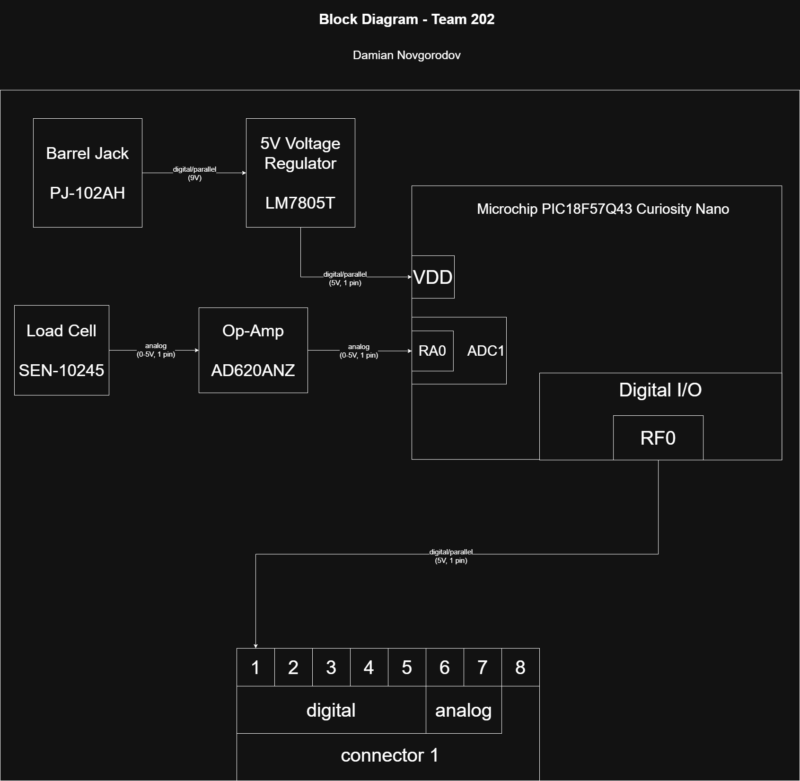

## Overview

My subsystem is fairly simple. For the power, it uses a barrel jack adaptor to provide 9V to the LM7805T voltage regulator which then powers the Curiosity Nano Board. For the weight system itself, my subsystem uses a 50kg load cell (a load cell, or weight sensor, that is able to detect up to 50kg of weight) which then sends its signal to a differential op-amp (as the signal from the load cell is in the millivolt range, whereas the Nano Board will need signals in the volt range to process). Afterwards, the analog signal is processed through an analog-to-digital converter (ADC) and is then sent on to another subsystem.

## Block Diagram

