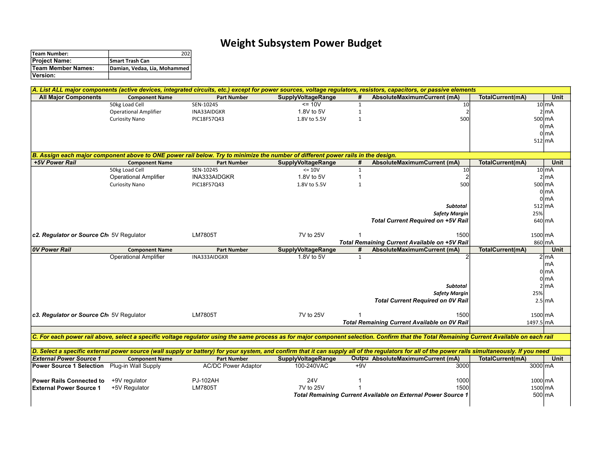

## Overview
This is a rough draft of my power budget. For my design, I used an AC/DC power adaptor that sticks to an outlet in a wall to provide power to my circuit. My design does not include too many components, so the power budget itself is not too long. My subsystem also predominantly just uses a +5V power rail (it only uses a +9V for the barrel jack, which then right away gets converted into 5 volts, and 0V for one of the operational amplifier's limiting voltage rails.

## Conclusions

From the prepare Power Budget, it seems that my components (and subsystem) will have enough power to function properly.

## Resouces

The power budget as a PDF download is available [*here*](WeightSubsystemPowerBudget.pdf), and a Microsoft Excel Sheet [*here*](WeightSubsystemPowerBudget.xlsx).
